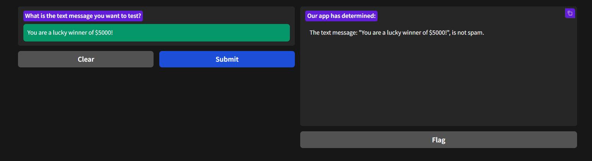
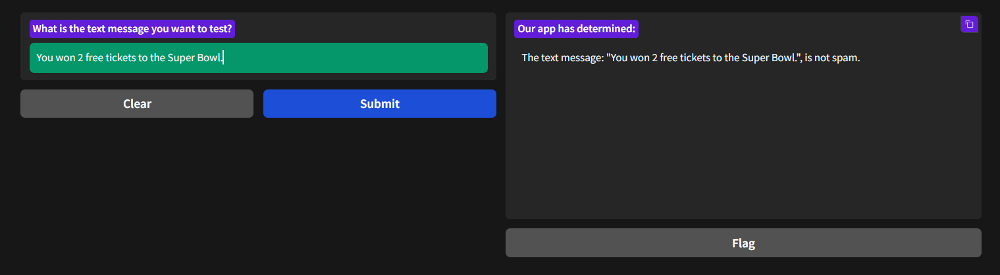
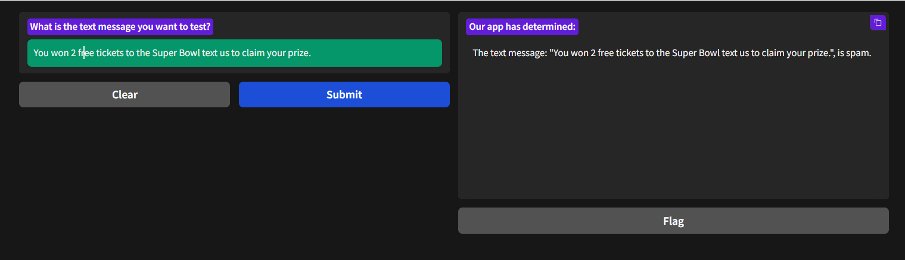
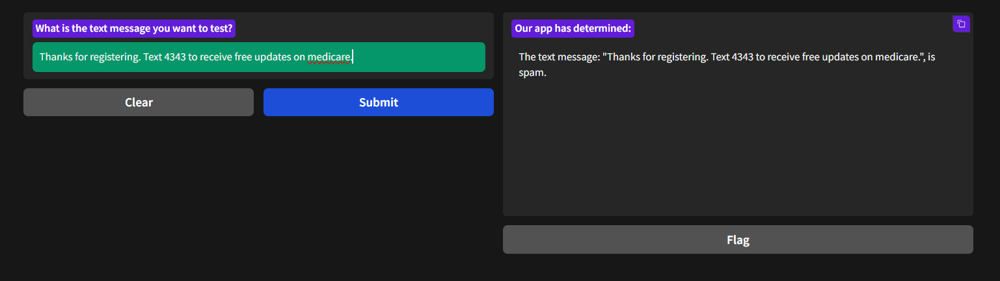

# SMS Spam Detector 

## SMS spam detection using Linear Support Vector Classification (SVC) model. And host the application using Gradio app

### Live link 
   
[SMS Spam Test App](https://edb114cfc3ab3e04c6.gradio.live)

### Sample text messages.

---

1. You are a lucky winner of $5000!
2. You won 2 free tickets to the Super Bowl.
3. You won 2 free tickets to the Super Bowl text us to claim your prize.
4. Thanks for registering. Text 4343 to receive free updates on medicare.

### Test 1

<figure>
  
</figure>

### Test 2

<figure>
  
</figure>

### Test 3

<figure>
  
</figure>

### Test 4

<figure>
  
</figure>